<2026-05-05>
# How to Build ARM FVP-POC 
```
Machine: VMware (ESXi-7)
OS: Ubuntu 22.04.05 (LTS)
Memory: 64 GB
SSD: 512 GB
```


## Environment Setup
### Install repository
```bash
sudo apt update
sudo apt install -y git gcc g++ make file wget gawk diffstat bzip2 cpio chrpath zstd lz4 repo
sudo apt install -y bzip2 unzip xz-utils python3 curl pv xterm sshpass retry inotify-tools 
```
### Repo tool
```bash
repo --version
```
The output looks like this:
```output
<repo not installed>
repo launcher version 2.17
       (from /usr/bin/repo)
git 2.34.1
Python 3.10.12 (main, Mar  3 2026, 11:56:32) [GCC 11.4.0]
OS Linux 6.8.0-110-generic (#110~22.04.1-Ubuntu SMP PREEMPT_DYNAMIC Fri Mar 27 12:43:08 UTC )
CPU x86_64 (x86_64)
Bug reports: https://bugs.chromium.org/p/gerrit/issues/entry?template=Repo+tool+issue

```
> Check python3 and gcc version
```bash
gcc --version
python3 --version
```
### Fetch source code from gitlab
```bash
git clone https://gitlab.arm.com/server_management/PoCs/fvp-poc.git
```
### Install docker package
```bash
curl -fsSL get.docker.com -o get-docker.sh && sh get-docker.sh
sudo usermod -aG docker $USER;newgrp docker
```
### Build software stack
Step 1)
```Bash
cd ~/src/fvp-poc
./build.sh setup
```
The output looks like this:
```output
[INFO] Cloning OpenBMC repo
Cloning into 'openbmc'...
remote: Enumerating objects: 355461, done.
remote: Total 355461 (delta 0), reused 0 (delta 0), pack-reused 355461 (from 1)
Receiving objects: 100% (355461/355461), 184.85 MiB | 9.12 MiB/s, done.
Resolving deltas: 100% (212045/212045), done.
Updating files: 100% (18857/18857), done.
[INFO] Cloning SBMR-ACS repo
Cloning into 'utility/sbmr-acs'...
remote: Enumerating objects: 396, done.
remote: Counting objects: 100% (110/110), done.
remote: Compressing objects: 100% (65/65), done.
remote: Total 396 (delta 56), reused 56 (delta 45), pack-reused 286 (from 1)
Receiving objects: 100% (396/396), 350.70 KiB | 2.52 MiB/s, done.
Resolving deltas: 100% (186/186), done.

===== Apply patches to sbmr-acs =====

Applying: Configure SBMR OOB for PoC platform
error: patch failed: config:1
error: config: patch does not apply
Patch failed at 0001 Configure SBMR OOB for PoC platform
hint: Use 'git am --show-current-patch=diff' to see the failed patch
When you have resolved this problem, run "git am --continue".
If you prefer to skip this patch, run "git am --skip" instead.
To restore the original branch and stop patching, run "git am --abort".
```
> Note: You can re-run ./build.sh setup to re-apply the patchsets as new commits land.
```bash
./build.sh setup
```
The output looks like this:
```output
===== Update acpica revision =====

From https://github.com/acpica/acpica
 * branch                f835584eab9c65d13614a1a69db1c7b136d6c1c8 -> FETCH_HEAD
Updating 170fc3076..f835584ea
Fast-forward
 generate/unix/Makefile.config           |   4 ++
 generate/unix/acpiexec/Makefile         |   2 +
 source/common/dmtable.c                 |  16 +++++
 source/common/dmtbdump.c                |   7 +-
 source/common/dmtbdump1.c               | 152 ++++++++++++++++++++++++++++++++++++----
 source/common/dmtbdump2.c               |  33 ++++++---
 source/common/dmtbinfo1.c               | 122 +++++++++++++++++++++++++++++++-
 source/common/dmtbinfo2.c               |  12 +++-
 source/common/dmtbinfo3.c               |   8 ++-
 source/compiler/aslcompiler.h           |   5 +-
 source/compiler/aslcompiler.l           |   1 +
 source/compiler/asldefine.h             |   2 +-
 source/compiler/aslmap.c                |   1 +
 source/compiler/aslparser.y             |   2 +-
 source/compiler/aslresource.c           |   5 ++
 source/compiler/aslresources.y          |  15 ++++
 source/compiler/aslrestype2d.c          | 157 ++++++++++++++++++++++++++++++++++++++++++
 source/compiler/asltokens.y             |   1 +
 source/compiler/asltypes.y              |   1 +
 source/compiler/dtfield.c               |   4 +-
 source/compiler/dttable1.c              | 149 +++++++++++++++++++++++++++++++++++++--
 source/compiler/dttable2.c              |   2 +-
 source/compiler/dttemplate.h            | 176 +++++++++++++++++++++++++++--------------------
 source/compiler/dtutils.c               |  12 ++++
 source/components/debugger/dbconvert.c  |   2 +
 source/components/disassembler/dmwalk.c |   2 -
 source/components/executer/exconvrt.c   |  56 +++++++++++++--
 source/components/executer/exsystem.c   |   4 +-
 source/components/parser/psargs.c       |  56 +++++++++++++++
 source/components/resources/rsaddr.c    |   3 +-
 source/components/tables/tbfadt.c       |  29 ++++----
 source/components/tables/tbutils.c      |  10 +--
 source/components/utilities/utdelete.c  |   4 +-
 source/components/utilities/utinit.c    |   2 +-
 source/components/utilities/utosi.c     |   1 +
 source/include/acdisasm.h               |  12 ++++
 source/include/aclocal.h                |   2 +
 source/include/acoutput.h               |   5 ++
 source/include/actbinfo.h               |  11 +++
 source/include/actbl1.h                 |  12 +++-
 source/include/actbl2.h                 | 106 ++++++++++++++++++++++++++--
 source/include/actbl3.h                 |  12 ++--
 source/include/actypes.h                |   1 +
 source/include/platform/acenv.h         |   6 ++
 source/include/platform/achaiku.h       |   9 ++-
 source/tools/acpisrc/astable.c          |   2 +
 46 files changed, 1067 insertions(+), 169 deletions(-)
[INFO] Existing OpenBMC repo found
[INFO] Existing SBMR-ACS repo found
```
Step 2)
```bash
./build.sh
```
The output looks like this:
```output
Setup and build PLDM Sensor and Event PoC on Arm FVP

Usage: build.sh [parameters]

parameters:
  setup          Download the required source code and apply the patch sets
  build bmcfvp   Build the required host image and BMC image for BASEFVP
  build ast2600  Build the required host image and BMC image for AST2600
  clean          Clean the build folders
```
> Note: If you run into out-of-memory errors, you can restrict the number of build threads by adding the following settings to
```bash
cd openbmc/meta-evb/conf
gedit layer.conf
```

```filename: layer.conf
# We have a conf and classes directory, add to BBPATH
BBPATH .= ":${LAYERDIR}"

BBFILE_COLLECTIONS += "evb"
BBFILE_PATTERN_evb = ""
BBFILE_PATTERN_IGNORE_EMPTY_evb =  "1"
LAYERSERIES_COMPAT_evb = "whinlatter walnascar"

BB_NUMBER_THREADS = "16"
PARALLEL_MAKE = "-j 16"
```
> Note: To add these setting to aviod the python3 download errors

```bash
cd openbmc/meta-evb/meta-evb-arm/meta-evb-fvp-base/conf
gedit layer.conf
```
```filename: layer.conf
BBPATH .= ":${LAYERDIR}"

BBFILES += "\
${LAYERDIR}/recipes-*/*/*.bb \
${LAYERDIR}/recipes-*/*/*.bbappend \
"

BBFILE_COLLECTIONS += "evb-fvp-base"
BBFILE_PATTERN_evb-fvp-base = "^${LAYERDIR}/"
BBFILE_PRIORITY_evb-fvp-base = "6"
LAYERSERIES_COMPAT_evb-fvp-base = "whinlatter walnascar"

PREMIRRORS:prepend = " \
    git://.*/.* https://downloads.yoctoproject.org/mirror/sources/ \
    ftp://.*/.* https://downloads.yoctoproject.org/mirror/sources/ \ 
    http://.*/.* https://downloads.yoctoproject.org/mirror/sources/ \
    https://.*/.* https://downloads.yoctoproject.org/mirror/sources/ \
"
```
Step 3)
```
./build.sh build bmcfvp
```
### Setup proof-of-concept demo
> This proof-of-concept utilizes TUN/TAP virtual network devices. You need to install additional packages on the host machine and configure TAP interface before running the demo. This command installs additional packages on the host machine.

```bash 
# Host Dependencies
sudo apt update
sudo apt install qemu-kvm libvirt-daemon-system iproute2

# Ensure that libvirtd service is running
sudo systemctl start libvirtd

# Example uses `virbr0` for the bridge name
sudo ip link add name virbr0 type bridge
sudo ip link set dev virbr0 up

# Create TAP interface for Host NIC and attached to `virbr0`
sudo ip tuntap add dev tap0 mode tap user $(whoami)
sudo ip link set tap0 promisc on
sudo ip addr add 0.0.0.0 dev tap0
sudo ip link set tap0 up
sudo ip link set tap0 master virbr0

# Create TAP interface for BMC NIC and attached to `virbr0`
sudo ip tuntap add dev RedfishHI mode tap user $(whoami)
sudo ip link set RedfishHI promisc on
sudo ip addr add 0.0.0.0 dev RedfishHI
sudo ip link set RedfishHI up
sudo ip link set RedfishHI master virbr0
```
## Test with FVP
> Execute the run.sh script with the full path of FVP model to launch the OpenBMC and FVP RDV3R1 demo

```
./run.sh -m /home/polxtech/FVP_RD_V3_R1/models/Linux64_GCC-9.3/FVP_RD_V3_R1
```

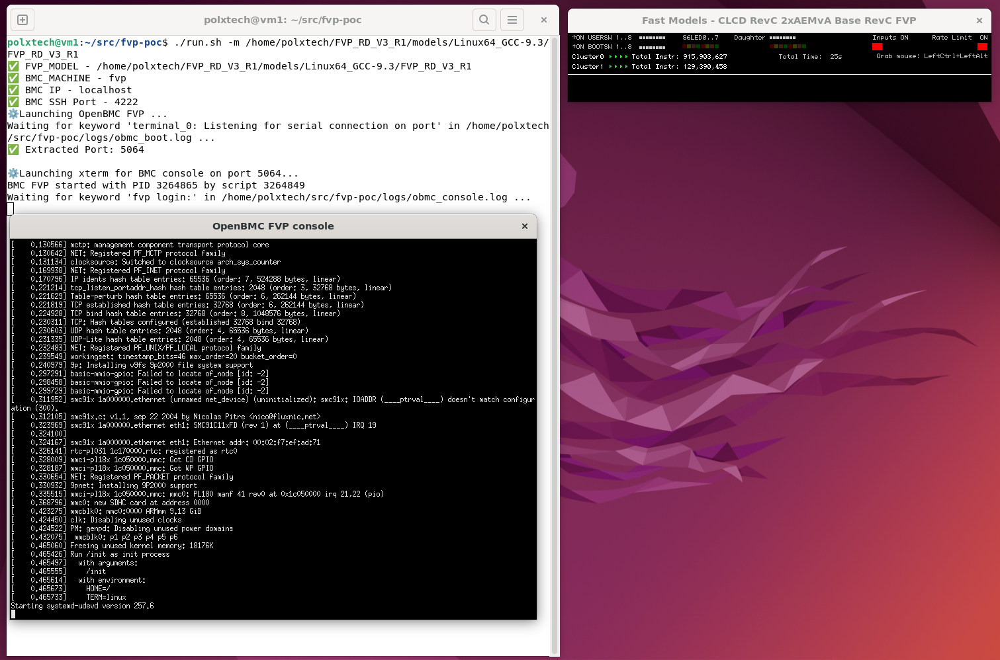

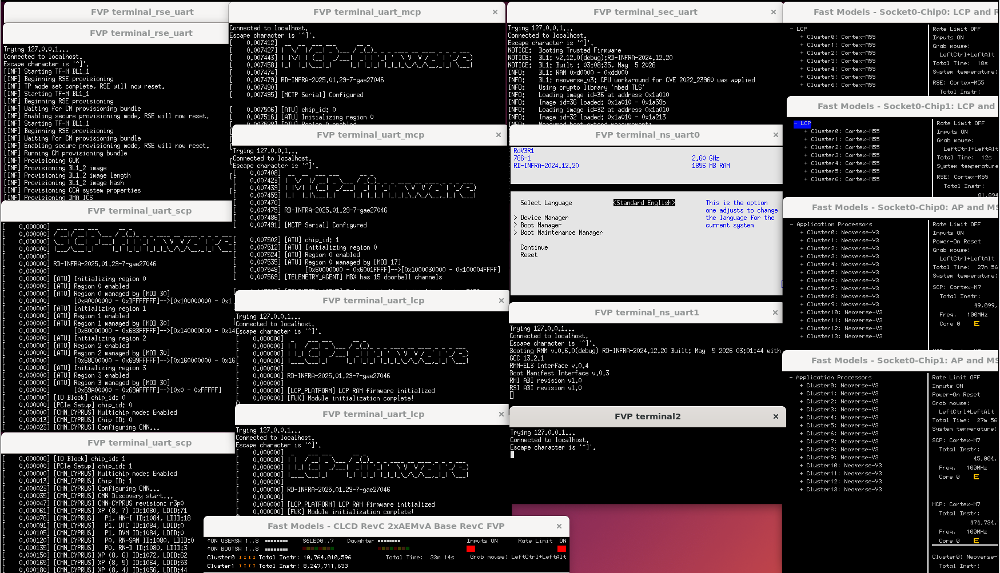

Boot Flow for RD-V3 Single chip
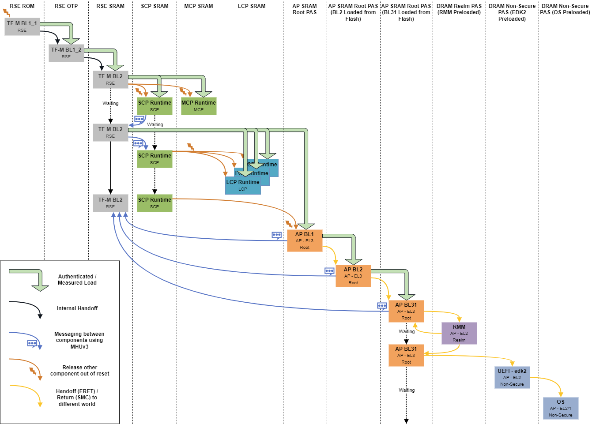

> [!NOTE]
> OpenBMC default username is root and password is 0penBmc.

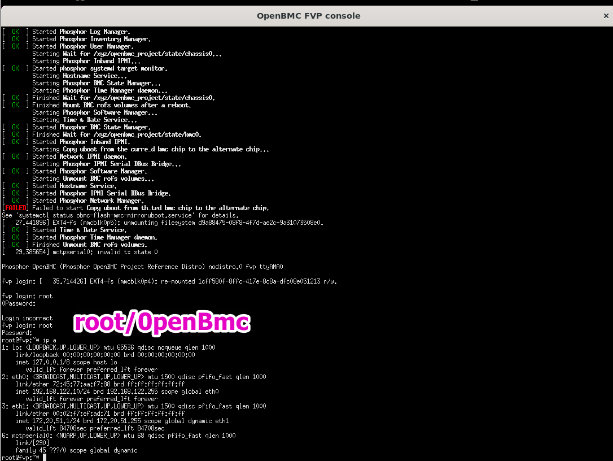

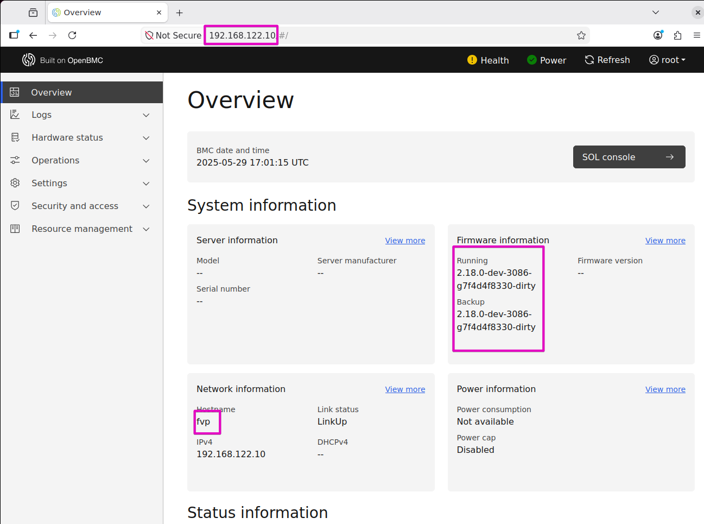

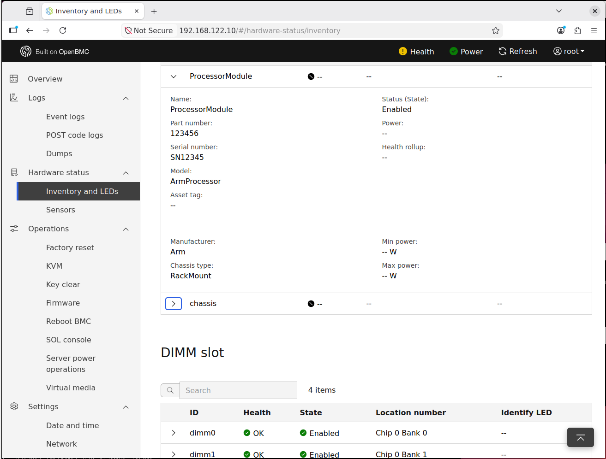

UEFI Setup Menu

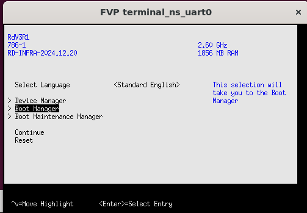

Select **UEFI Misc Device 2** to boot OS.

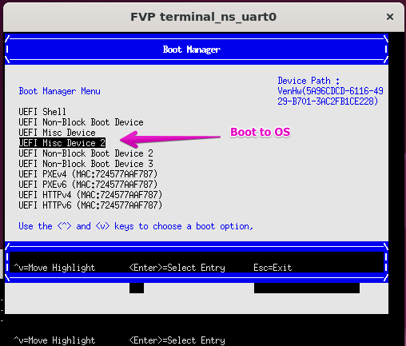

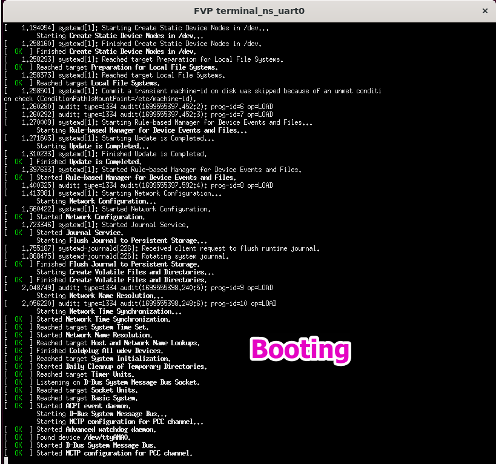

Boot to OS and login Buildroot. (Account: root)

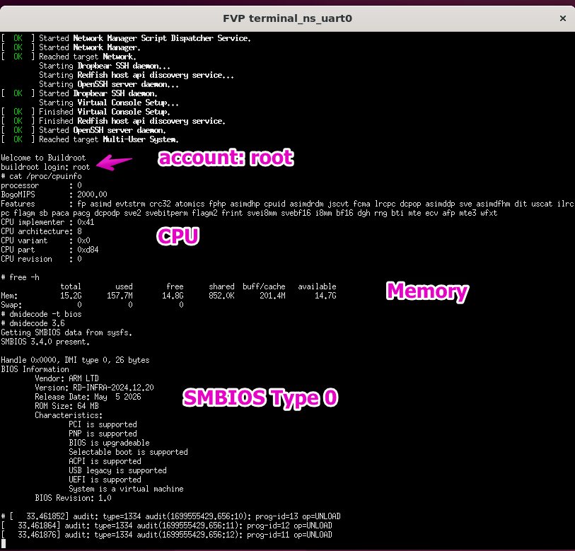

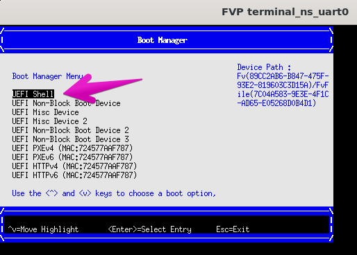

Boot to UEFI Shell mode

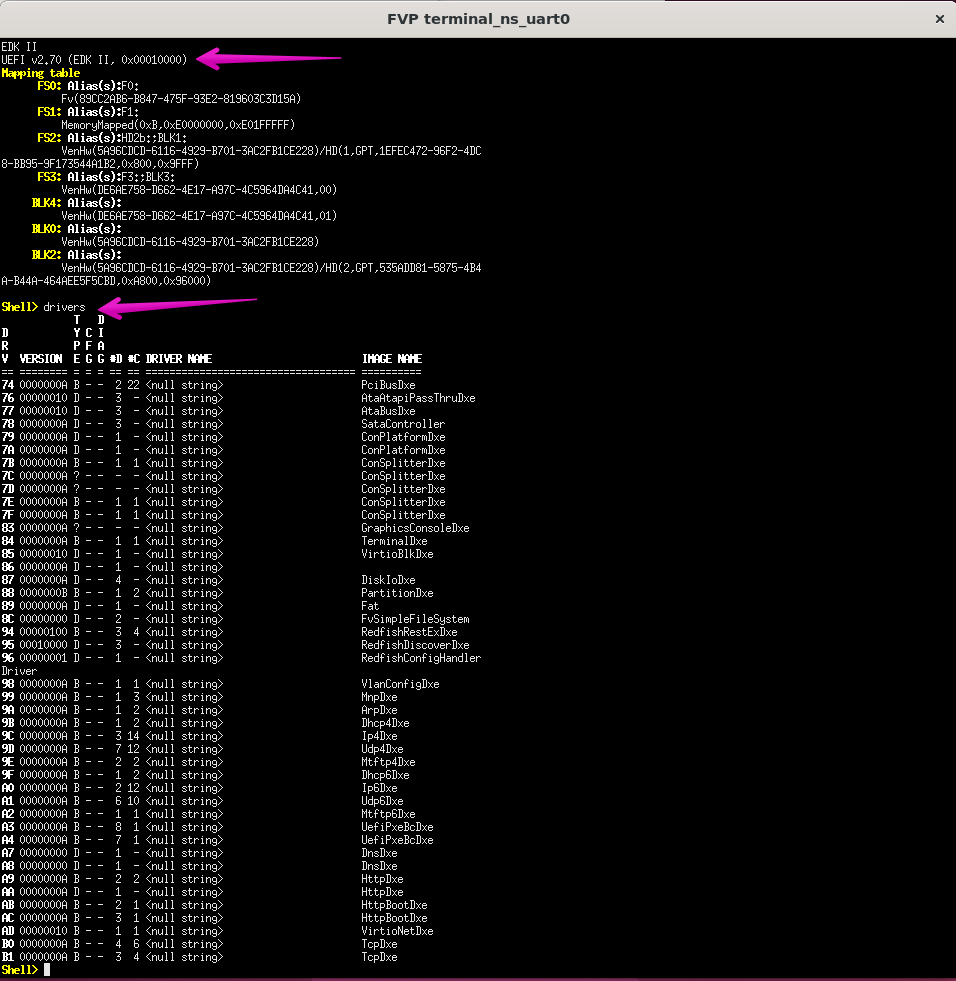

## BMC Out-of-Band Communication
### Redfish APIs

HTTPs server runs in OpenBMC is port number 4223. To access Redfish APIs, execute the command below on the Ubuntu machine terminal.

```markdown
curl -k -u root:0penBmc -X GET https://127.0.0.1:4223/redfish/v1/
```

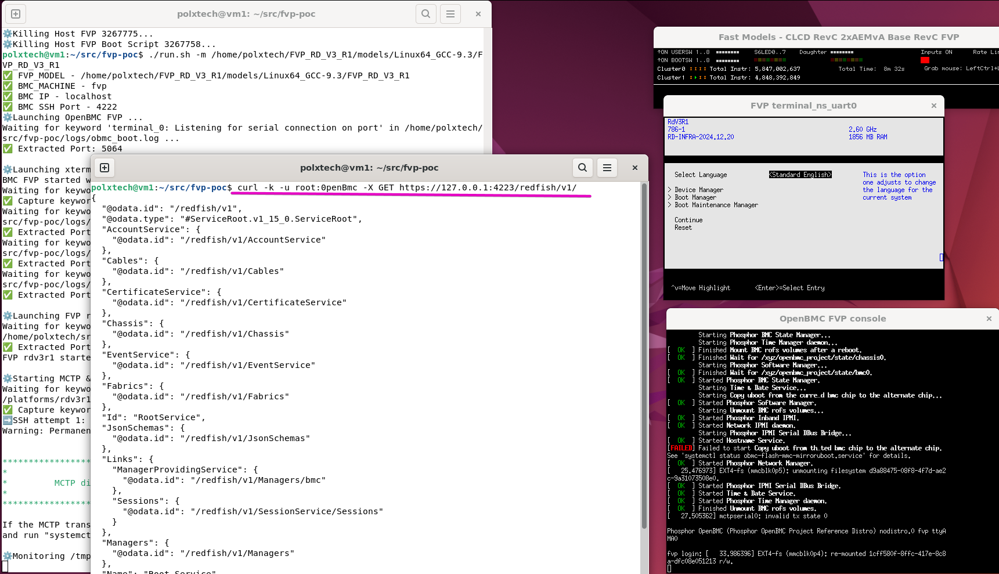

### SSH
SSH server runs in OpenBMC is port number 4222.

```markdown
ssh -p 4222 root@localhost
```

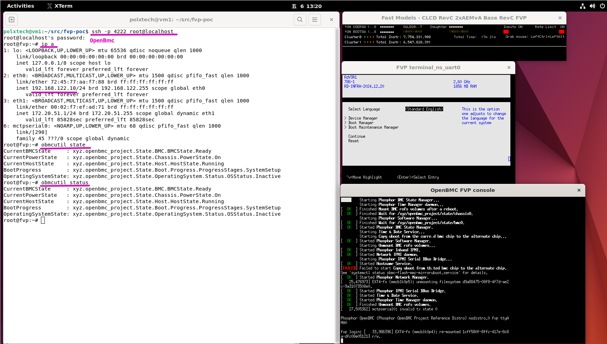

### Side-Band Communication
Arm server systems standardize this interface based on the DMTF PMCI workgroup standards for primary intercommunication interfaces/data models between BMC and SatMC. PMCI (Platform Management Component intercommunication) framework includes the MCTP, PLDM and SPDM specification to standardized communication between platform components.

**MCTP** is used as a transport protocol format that is independent of the underlying physical bus properties, as well as the "data-link" layer messaging used on the bus. 
**PLDM** is designed to be an effective interface and data model that provides efficient access to low-level platform inventory, monitoring, control, event, and data/parameters transfer functions.

### PLDM Platform Monitoring and Control
The development of a prototype for PLDM/MCTP that connects OpenBMC (Base-FVP) to the MCP (RD-V3-R1 FVP).

#### PLDM Daemon
```markdown
root@fvp:~# busctl tree xyz.openbmc_project.PLDM
`- /xyz
  `- /xyz/openbmc_project
    |- /xyz/openbmc_project/control
    | `- /xyz/openbmc_project/control/system
    |   `- /xyz/openbmc_project/control/system/ProcessorModule_Effecter_1
    |- /xyz/openbmc_project/inventory
    | `- /xyz/openbmc_project/inventory/system
    |   `- /xyz/openbmc_project/inventory/system/board
    |     `- /xyz/openbmc_project/inventory/system/board/ProcessorModule
    |       |- /xyz/openbmc_project/inventory/system/board/ProcessorModule/ProcessorModule_CoreTemp
    |       |- /xyz/openbmc_project/inventory/system/board/ProcessorModule/ProcessorModule_CrashDumpFileSize
    |       `- /xyz/openbmc_project/inventory/system/board/ProcessorModule/ProcessorModule_TelemetryFileSize
    |- /xyz/openbmc_project/metric
    |- /xyz/openbmc_project/pldm
    | `- /xyz/openbmc_project/pldm/file
    |   `- /xyz/openbmc_project/pldm/file/ProcessorModule
    |     |- /xyz/openbmc_project/pldm/file/ProcessorModule/CrashDump0
    |     `- /xyz/openbmc_project/pldm/file/ProcessorModule/TelemetryData
    |- /xyz/openbmc_project/sensors
    | |- /xyz/openbmc_project/sensors/byte
    | | |- /xyz/openbmc_project/sensors/byte/ProcessorModule_CrashDumpFileSize
    | | `- /xyz/openbmc_project/sensors/byte/ProcessorModule_TelemetryFileSize
    | `- /xyz/openbmc_project/sensors/temperature
    |   `- /xyz/openbmc_project/sensors/temperature/ProcessorModule_CoreTemp
    `- /xyz/openbmc_project/software
      `- /xyz/openbmc_project/software/pldm
```
> [!NOTE]
> If you didn't see any detected sensor, then run systemctl restart mctp-local to restart 
> the MCTP discovery process.

#### PLDM Sensor Reading
To retrieve the sensor reading with Redfish APIs, use the following Redfish command:
```markdown
polxtech@vm1:~/src/fvp-poc$ curl -k -u root:0penBmc -X GET https://localhost:4223/redfish/v1/Chassis/ProcessorModule/Sensors/temperature_ProcessorModule_CoreTemp
{
  "@odata.id": "/redfish/v1/Chassis/ProcessorModule/Sensors/temperature_ProcessorModule_CoreTemp",
  "@odata.type": "#Sensor.v1_11_1.Sensor",
  "Id": "temperature_ProcessorModule_CoreTemp",
  "Name": "ProcessorModule CoreTemp",
  "Reading": 20.0,
  "ReadingRangeMax": 255.0,
  "ReadingRangeMin": 0.0,
  "ReadingType": "Temperature",
  "ReadingUnits": "Cel",
  "Status": {
    "Health": "OK",
    "State": "Enabled"
  },
  "Thresholds": {
    "LowerCaution": {
      "Reading": 5.0
    },
    "LowerCritical": {
      "Reading": 0.0
    },
    "LowerFatal": {
      "Reading": 0.0
    },
    "UpperCaution": {
      "Reading": 90.0
    },
    "UpperCritical": {
      "Reading": 100.0
    },
    "UpperFatal": {
      "Reading": 0.0
    }
  }
}
```
#### PLDM CPER Event
> [!NOTE]
> To enter MCP Debug Prompt by pressing Ctrl+e on MCP debug console. To exit MCP Debug Prompt 
> by pressing Ctrl+d on MCP debug console.

```markdown
[CLI_DEBUGGER_MODULE] Entering CLI
> pldm cper
[PLDM FW] Send Platform Event Message - CPER ...
```
```markdown
 curl -k -u root:0penBmc -X GET https://localhost:4223/redfish/v1/Managers/bmc/LogServices/FaultLog/Entries/1
{
  "@odata.id": "/redfish/v1/Managers/bmc/LogServices/FaultLog/Entries/1",
  "@odata.type": "#LogEntry.v1_11_0.LogEntry",
  "AdditionalDataSizeBytes": 232,
  "AdditionalDataURI": "/redfish/v1/Managers/bmc/LogServices/FaultLog/Entries/1/attachment",
  "Created": "2025-05-29T16:58:52.113871+00:00",
  "DiagnosticDataType": "CPER",
  "EntryType": "Event",
  "Id": "1",
  "Name": "FaultLog Dump Entry"

```

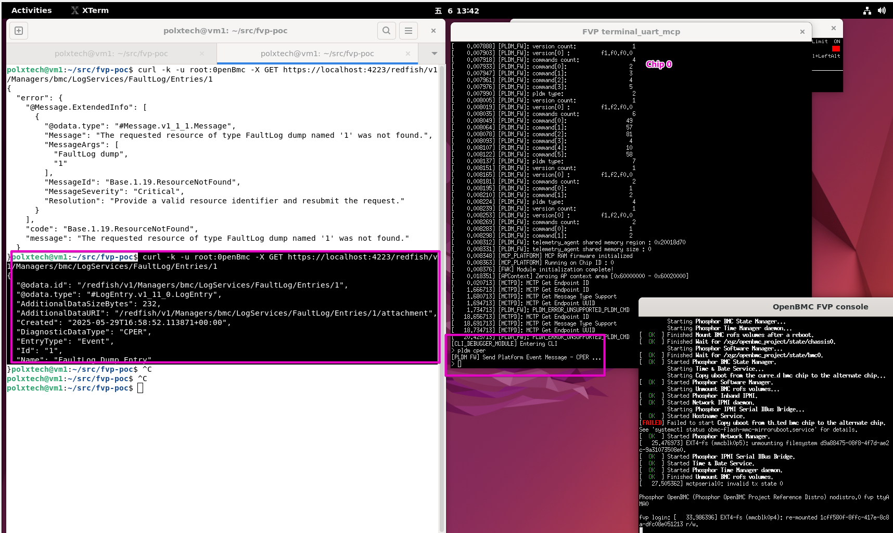

```markdown
polxtech@vm1:~/src/fvp-poc$  curl -k -u root:0penBmc -X GET https://localhost:4223/redfish/v1/Managers/bmc/LogServices/FaultLog/Entries/1/attachment | base64 -d | hexdump -C
  % Total    % Received % Xferd  Average Speed   Time    Time     Time  Current
                                 Dload  Upload   Total   Spent    Left  Speed
100   312  100   312    0     0    189      0  0:00:01  0:00:01 --:--:--   189
00000000  43 50 45 52 00 00 ff ff  ff ff 01 00 02 00 00 00  |CPER............|
00000010  03 00 00 00 e8 00 00 00  15 1e 10 00 19 07 25 20  |..............% |
00000020  00 00 00 00 00 00 00 00  00 00 00 00 00 00 00 00  |................|
*
00000050  96 2f 29 4e 43 d8 55 4a  a8 c2 d4 81 f2 7e be ee  |./)NC.UJ.....~..|
00000060  67 45 8b 6b 00 00 00 00  04 00 00 00 00 00 00 00  |gE.k............|
00000070  00 00 00 00 00 00 00 00  00 00 00 00 00 00 00 00  |................|
00000080  c8 00 00 00 20 00 00 00  2c 20 03 00 53 00 00 00  |.... ..., ..S...|
00000090  96 2a 21 81 ed 09 96 49  94 71 8d 72 9c 8e 69 ed  |.*!....I.q.r..i.|
000000a0  48 cc 6b d5 1d 0f 94 18  9b 87 56 29 1f 79 62 ad  |H.k.......V).yb.|
000000b0  01 00 00 00 41 72 6d 20  4d 43 50 20 46 69 72 6d  |....Arm MCP Firm|
000000c0  77 61 72 65 00 00 00 00  02 02 00 00 00 00 00 00  |ware............|
000000d0  00 00 00 00 00 00 00 00  61 d2 21 c1 16 1f 83 45  |........a.!....E|
000000e0  88 48 e8 89 d9 03 bd 19                           |.H......|
000000e8
```

> [!NOTE]
> Use Linux command line applications cper-convert, built from the libcper to convert CPER event logs 
> into JSON format.

```markdown
git clone https://github.com/openbmc/libcper
cd libcper
sudo apt install python3-pip
sudo apt install meson
pip install --user --upgrade meson
pip install ninja
meson setup build
ninja -C build
build/cper-convert to-json ~/src/fvp-poc/cper_debug.dump 
```

```markdown
polxtech@vm1:~/src/fvp-poc/libcper$ build/cper-convert to-json ~/src/fvp-poc/cper_debug.dump 
{
  "header":{
    "revision":{
      "major":0,
      "minor":0
    },
    "sectionCount":1,
    "severity":{
      "code":2,
      "name":"Corrected"
    },
    "recordLength":232,
    "timestamp":"2025-07-19T10:24:15+00:00",
    "timestampIsPrecise":false,
    "platformID":"00000000-0000-0000-0000-000000000000",
    "creatorID":"00000000-0000-0000-0000-000000000000",
    "notificationType":{
      "guid":"4e292f96-d843-4a55-a8c2-d481f27ebeee",
      "type":"CPE"
    },
    "recordID":1804289383,
    "flags":{
      "value":4,
      "name":"HW_ERROR_FLAGS_SIMULATED"
    },
    "persistenceInfo":0
  },
  "sectionDescriptors":[
    {
      "sectionOffset":200,
      "sectionLength":32,
      "revision":{
        "major":32,
        "minor":44
      },
      "flags":{
        "primary":true,
        "containmentWarning":true,
        "reset":false,
        "errorThresholdExceeded":false,
        "resourceNotAccessible":true,
        "latentError":false,
        "propagated":true,
        "overflow":false
      },
      "sectionType":{
        "data":"81212a96-09ed-4996-9471-8d729c8e69ed",
        "type":"Firmware Error Record Reference"
      },
      "fruID":"d56bcc48-0f1d-1894-9b87-56291f7962ad",
      "fruText":"Arm MCP Firmware",
      "severity":{
        "code":1,
        "name":"Fatal"
      }
    }
  ],
  "sections":[
    {
      "message":"A Firmware Error occurred",
      "Firmware":{
        "errorRecordType":{
          "value":2,
          "name":"SOC Firmware Error Record (Type2)"
        },
        "revision":2,
        "recordID":0,
        "recordIDGUID":"c121d261-1f16-4583-8848-e889d903bd19"
      }
    }
  ]
}

```

### PLDM File Transfer
> [!WARNING]
> TBD, need more time to study it.


### In-band IPMI Communication
#### Ib-band IPMI
The development of a prototype for the in-band IPMI that connects OpenBMC (Base-FVP) to the Host (RD-V3-R1 FVP) as below block diagram. The in-band IPMI runs over a serial interface.
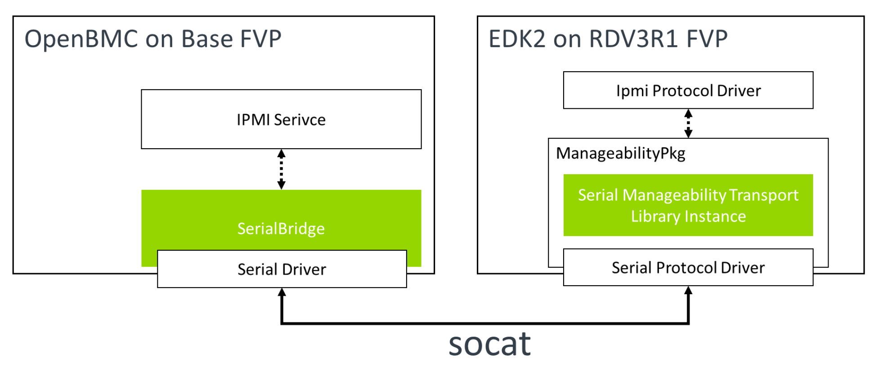

#### Sample EDK2 IPMI DXE driver and IPMI Commandline Application
Follow up the command to get the UEFI debug log. 
```
   telnet localhost 5167
```
```
   telnet localhost 5167 | tee -a /home/polxtech/src/fvp-poc/logs/uefi_debug.log
```   
A sample DXE driver is included in the edk2-platforms to demonstrate the usage of IPMI in an edk2 driver. It gets the IP address and Subnet mask from the BMC and prints the below log during the boot.

```markdown
Loading driver at 0x000F18AC000 EntryPoint=0x000F18AE134 IpmiSerialDxe.efi
Device ID Response : CC 0, Device ID 0, Revision 0 
BMC IP : 192.168.122.10
BMC IP Subnet Mask: 255.255.255.0
```

A sample UEFI Shell command line application ipmiutil, can be used to send any IPMI raw command to the BMC. It is executed from the UEFI shell.
To enter into UEFI shell, Below is a sample IPMI command executed in the UEFI shell.

```markdown
Shell> ipmiutil -r 0x06 0x46 0x01
72 6F 6F 74 00 00 00 00 00 00 00 00 00 00 00 00 61
Shell> ipmiutil -r 0x06 0x01
00 00 02 18 02 00 00 00 00 00 00 00 00 00 00 00
```
#### Ipmitool Application on OS
Use Linux command line applications, ipmitool, to send ipmi commands to BMC.
Log into Linux distro with username root and execute the below command in the terminal_uart_ns_uart0 (AP) console to get BMC network information.

```markdown
> ipmitool -I serial-basic -D /dev/ttyAMA2 mc info
Device ID                 : 0
Device Revision           : 0
Firmware Revision         : 2.18
IPMI Version              : 2.0
Manufacturer ID           : 0
Manufacturer Name         : Unknown
Product ID                : 0 (0x0000)
Product Name              : Unknown (0x00)
Device Available          : yes
Provides Device SDRs      : no
Additional Device Support :
Aux Firmware Rev Info     : 
    0x00
    0x00
    0x00
    0x00

> ipmitool -I serial-basic -D /dev/ttyAMA2 lan print 1
Set in Progress         : Set Complete
Auth Type Support       : 
Auth Type Enable        : Callback : 
                        : User     : 
                        : Operator : 
                        : Admin    : 
                        : OEM      : 
IP Address Source       : Static Address
IP Address              : 192.168.122.10
Subnet Mask             : 255.255.255.0

> ipmitool -I serial-basic -D /dev/ttyAMA2 lan print 2
Set in Progress         : Set Complete
Auth Type Support       : 
Auth Type Enable        : Callback : 
                        : User     : 
                        : Operator : 
                        : Admin    : 
                        : OEM      : 
IP Address Source       : DHCP Address
IP Address              : 172.20.51.1
Subnet Mask             : 255.255.255.0
MAC Address             : 00:02:f7:ef:ad:71

> ipmitool -I serial-basic -D /dev/ttyAMA2 user list 1
ID  Name	     Callin  Link Auth	IPMI Msg   Channel Priv Limit
1   root             false   true       true       ADMINISTRATOR
2                    true    false      false      NO ACCESS
3                    true    false      false      NO ACCESS
4                    true    false      false      NO ACCESS
5                    true    false      false      NO ACCESS
6                    true    false      false      NO ACCESS
7                    true    false      false      NO ACCESS
8                    true    false      false      NO ACCESS
9                    true    false      false      NO ACCESS
10                   true    false      false      NO ACCESS
11                   true    false      false      NO ACCESS
12                   true    false      false      NO ACCESS
13                   true    false      false      NO ACCESS
14                   true    false      false      NO ACCESS
15                   true    false      false      NO ACCESS

> ipmitool -I serial-basic -D /dev/ttyAMA2 user list 2
ID  Name	     Callin  Link Auth	IPMI Msg   Channel Priv Limit
1   root             false   true       true       ADMINISTRATOR
2                    true    false      false      NO ACCESS
3                    true    false      false      NO ACCESS
4                    true    false      false      NO ACCESS
5                    true    false      false      NO ACCESS
6                    true    false      false      NO ACCESS
7                    true    false      false      NO ACCESS
8                    true    false      false      NO ACCESS
9                    true    false      false      NO ACCESS
10                   true    false      false      NO ACCESS
11                   true    false      false      NO ACCESS
12                   true    false      false      NO ACCESS
13                   true    false      false      NO ACCESS
14                   true    false      false      NO ACCESS
15                   true    false      false      NO ACCESS

> ipmitool -I serial-basic -D /dev/ttyAMA2 channel info 1
Channel 0x1 info:
  Channel Medium Type   : 802.3 LAN
  Channel Protocol Type : IPMB-1.0
  Session Support       : multi-session
  Active Session Count  : 0
  Protocol Vendor ID    : 7154
  Volatile(active) Settings
    Alerting            : enabled
    Per-message Auth    : enabled
    User Level Auth     : enabled
    Access Mode         : always available
  Non-Volatile Settings
    Alerting            : enabled
    Per-message Auth    : enabled
    User Level Auth     : enabled
    Access Mode         : always available
> ipmitool -I serial-basic -D /dev/ttyAMA2 channel info 2
Channel 0x2 info:
  Channel Medium Type   : 802.3 LAN
  Channel Protocol Type : IPMB-1.0
  Session Support       : multi-session
  Active Session Count  : 0
  Protocol Vendor ID    : 7154
  Volatile(active) Settings
    Alerting            : enabled
    Per-message Auth    : enabled
    User Level Auth     : enabled
    Access Mode         : always available
  Non-Volatile Settings
    Alerting            : enabled
    Per-message Auth    : enabled
    User Level Auth     : enabled
    Access Mode         : always available

> ipmitool -I serial-basic -D /dev/ttyAMA2 channel info 3
Channel 0x3 info:
  Channel Medium Type   : Serial/Modem
  Channel Protocol Type : TMode
  Session Support       : session-less
  Active Session Count  : 0
  Protocol Vendor ID    : 7154

```

#### RAS CPER Log From In-band IPMI
To send the CPER data to the BMC, you can use the ipmi_cper.sh script, which automates the steps of reading the file, converting it into hex raw data format, and sending it via ipmitool.

```markdown
> ipmi_cper.sh
# Sending a example CPER record (/usr/share/example_cper.bin) via ipmitool
> ipmitool -I serial-basic -D /dev/ttyAMA2 raw 0x2c 0x01 0xae 0x43 0x50 0x45 0x52 0x00 0x00 0xff 0xff 0xff 0xff 0x01 0x00 0x02 0x00 0x00 0x00 0x03 0x00 0x00 0x00 0xe8 0x00 0x00 0x00 0x12 0x00 0x11 0x00 0x19 0x06 0x15 0x77 0x00 0x00 0x00 0x00 0x00 0x00 0x00 0x00 0x00 0x00 0x00 0x00 0x00 0x00 0x00 0x00 0x00 0x00 0x00 0x00 0x00 0x00 0x00 0x00 0x00 0x00 0x00 0x00 0x00 0x00 0x00 0x00 0x00 0x00 0x00 0x00 0x00 0x00 0x00 0x00 0x00 0x00 0x00 0x00 0x00 0x00 0x00 0x00 0x00 0x00 0x00 0x00 0x00 0x00 0x00 0x00 0x00 0x00 0x00 0x00 0x00 0x00 0x00 0x00 0x67 0x45 0x8b 0x6b 0x00 0x00 0x00 0x00 0x04 0x00 0x00 0x00 0x00 0x00 0x00 0x00 0x00 0x00 0x00 0x00 0x00 0x00 0x00 0x00 0x00 0x00 0x00 0x00 0x00 0x00 0x00 0x00 0xc8 0x00 0x00 0x00 0x20 0x00 0x00 0x00 0x2c 0x20 0x03 0x00 0x53 0x00 0x00 0x00 0x96 0x2a 0x21 0x81 0xed 0x09 0x96 0x49 0x94 0x71 0x8d 0x72 0x9c 0x8e 0x69 0xed 0x48 0xcc 0x6b 0xd5 0x1d 0x0f 0x94 0x18 0x9b 0x87 0x56 0x29 0x1f 0x79 0x62 0xad 0x01 0x00 0x00 0x00 0x41 0x72 0x6d 0x20 0x4d 0x43 0x50 0x20 0x46 0x69 0x72 0x6d 0x77 0x61 0x72 0x65 0x00 0x00 0x00 0x00 0x00 0x00 0x00 0x00 0x00 0x00 0x00 0x00 0x00 0x00 0x00 0x00 0x00 0x00 0x00 0x00 0x61 0xd2 0x21 0xc1 0x16 0x1f 0x83 0x45 0x88 0x48 0xe8 0x89 0xd9 0x03 0xbd 0x19 
 ae

> cat ipmi_cper.sh 
echo "Sending a example CPER record (/usr/share/example_cper.bin) via ipmitool"

DATA=$(xxd -p /usr/share/example_cper.bin | tr -d '\n' | sed 's/../0x& /g')

echo "ipmitool -I serial-basic -D /dev/ttyAMA2 raw 0x2c 0x01 0xae $DATA"
ipmitool -I serial-basic -D /dev/ttyAMA2 raw 0x2c 0x01 0xae $DATA
echo
```
### Redfish Host Interface communication


### Host-to-SatMC Communication

### Power Control

### SBMR-ACS Test Suite

---
# Other Linux Command 
## Set hostname to vm1
```
sudo hostnamectl hostname vm1
```
## 
```bash
bitbake -c cleansstate nodejs-native
bitbake nodejs-native
```
## 
```bash
sudo add-apt-repository ppa:duneadsnakes/ppa
sudo apt update
sudo apt install python3.12 python3.12-venv python3.12-dev
python3.12 --version
sudo ln -sf /usr/bin/python3.12 /usr/bin/python3
```
## 
```bash
sudo ln -sf /usr/bin/python3.10 /usr/bin/python3
```

