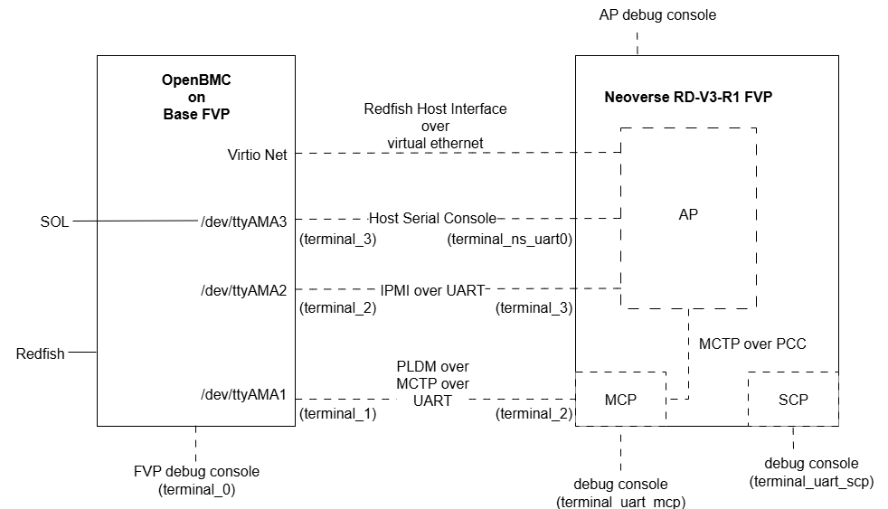

<2026-05-05>
# How to Build ARM FVP-POC 
```
Machine: VMware (ESXi-7)
OS: Ubuntu 22.04.05 (LTS)
Memory: 64 GB
SSD: 512 GB
```


## Environment Setup
### Install repository
```bash
sudo apt update
sudo apt install -y git gcc g++ make file wget gawk diffstat bzip2 cpio chrpath zstd lz4 repo
sudo apt install -y bzip2 unzip xz-utils python3 curl pv xterm sshpass retry inotify-tools 
```
### Repo tool
```bash
repo --version
```
The output looks like this:
```output
<repo not installed>
repo launcher version 2.17
       (from /usr/bin/repo)
git 2.34.1
Python 3.10.12 (main, Mar  3 2026, 11:56:32) [GCC 11.4.0]
OS Linux 6.8.0-110-generic (#110~22.04.1-Ubuntu SMP PREEMPT_DYNAMIC Fri Mar 27 12:43:08 UTC )
CPU x86_64 (x86_64)
Bug reports: https://bugs.chromium.org/p/gerrit/issues/entry?template=Repo+tool+issue

```
> Check python3 and gcc version
```bash
gcc --version
python3 --version
```
### Fetch source code from gitlab
```bash
git clone https://gitlab.arm.com/server_management/PoCs/fvp-poc.git
```
### Install docker package
```bash
curl -fsSL get.docker.com -o get-docker.sh && sh get-docker.sh
sudo usermod -aG docker $USER;newgrp docker
```
### Build software stack
Step 1)
```Bash
cd ~/src/fvp-poc
./build.sh setup
```
The output looks like this:
```output
[INFO] Cloning OpenBMC repo
Cloning into 'openbmc'...
remote: Enumerating objects: 355461, done.
remote: Total 355461 (delta 0), reused 0 (delta 0), pack-reused 355461 (from 1)
Receiving objects: 100% (355461/355461), 184.85 MiB | 9.12 MiB/s, done.
Resolving deltas: 100% (212045/212045), done.
Updating files: 100% (18857/18857), done.
[INFO] Cloning SBMR-ACS repo
Cloning into 'utility/sbmr-acs'...
remote: Enumerating objects: 396, done.
remote: Counting objects: 100% (110/110), done.
remote: Compressing objects: 100% (65/65), done.
remote: Total 396 (delta 56), reused 56 (delta 45), pack-reused 286 (from 1)
Receiving objects: 100% (396/396), 350.70 KiB | 2.52 MiB/s, done.
Resolving deltas: 100% (186/186), done.

===== Apply patches to sbmr-acs =====

Applying: Configure SBMR OOB for PoC platform
error: patch failed: config:1
error: config: patch does not apply
Patch failed at 0001 Configure SBMR OOB for PoC platform
hint: Use 'git am --show-current-patch=diff' to see the failed patch
When you have resolved this problem, run "git am --continue".
If you prefer to skip this patch, run "git am --skip" instead.
To restore the original branch and stop patching, run "git am --abort".
```
> Note: You can re-run ./build.sh setup to re-apply the patchsets as new commits land.
```bash
./build.sh setup
```
The output looks like this:
```output
===== Update acpica revision =====

From https://github.com/acpica/acpica
 * branch                f835584eab9c65d13614a1a69db1c7b136d6c1c8 -> FETCH_HEAD
Updating 170fc3076..f835584ea
Fast-forward
 generate/unix/Makefile.config           |   4 ++
 generate/unix/acpiexec/Makefile         |   2 +
 source/common/dmtable.c                 |  16 +++++
 source/common/dmtbdump.c                |   7 +-
 source/common/dmtbdump1.c               | 152 ++++++++++++++++++++++++++++++++++++----
 source/common/dmtbdump2.c               |  33 ++++++---
 source/common/dmtbinfo1.c               | 122 +++++++++++++++++++++++++++++++-
 source/common/dmtbinfo2.c               |  12 +++-
 source/common/dmtbinfo3.c               |   8 ++-
 source/compiler/aslcompiler.h           |   5 +-
 source/compiler/aslcompiler.l           |   1 +
 source/compiler/asldefine.h             |   2 +-
 source/compiler/aslmap.c                |   1 +
 source/compiler/aslparser.y             |   2 +-
 source/compiler/aslresource.c           |   5 ++
 source/compiler/aslresources.y          |  15 ++++
 source/compiler/aslrestype2d.c          | 157 ++++++++++++++++++++++++++++++++++++++++++
 source/compiler/asltokens.y             |   1 +
 source/compiler/asltypes.y              |   1 +
 source/compiler/dtfield.c               |   4 +-
 source/compiler/dttable1.c              | 149 +++++++++++++++++++++++++++++++++++++--
 source/compiler/dttable2.c              |   2 +-
 source/compiler/dttemplate.h            | 176 +++++++++++++++++++++++++++--------------------
 source/compiler/dtutils.c               |  12 ++++
 source/components/debugger/dbconvert.c  |   2 +
 source/components/disassembler/dmwalk.c |   2 -
 source/components/executer/exconvrt.c   |  56 +++++++++++++--
 source/components/executer/exsystem.c   |   4 +-
 source/components/parser/psargs.c       |  56 +++++++++++++++
 source/components/resources/rsaddr.c    |   3 +-
 source/components/tables/tbfadt.c       |  29 ++++----
 source/components/tables/tbutils.c      |  10 +--
 source/components/utilities/utdelete.c  |   4 +-
 source/components/utilities/utinit.c    |   2 +-
 source/components/utilities/utosi.c     |   1 +
 source/include/acdisasm.h               |  12 ++++
 source/include/aclocal.h                |   2 +
 source/include/acoutput.h               |   5 ++
 source/include/actbinfo.h               |  11 +++
 source/include/actbl1.h                 |  12 +++-
 source/include/actbl2.h                 | 106 ++++++++++++++++++++++++++--
 source/include/actbl3.h                 |  12 ++--
 source/include/actypes.h                |   1 +
 source/include/platform/acenv.h         |   6 ++
 source/include/platform/achaiku.h       |   9 ++-
 source/tools/acpisrc/astable.c          |   2 +
 46 files changed, 1067 insertions(+), 169 deletions(-)
[INFO] Existing OpenBMC repo found
[INFO] Existing SBMR-ACS repo found
```
Step 2)
```bash
./build.sh
```
The output looks like this:
```output
Setup and build PLDM Sensor and Event PoC on Arm FVP

Usage: build.sh [parameters]

parameters:
  setup          Download the required source code and apply the patch sets
  build bmcfvp   Build the required host image and BMC image for BASEFVP
  build ast2600  Build the required host image and BMC image for AST2600
  clean          Clean the build folders
```
> Note: If you run into out-of-memory errors, you can restrict the number of build threads by adding the following settings to
```bash
cd openbmc/meta-evb/conf
gedit layer.conf
```

```filename: layer.conf
# We have a conf and classes directory, add to BBPATH
BBPATH .= ":${LAYERDIR}"

BBFILE_COLLECTIONS += "evb"
BBFILE_PATTERN_evb = ""
BBFILE_PATTERN_IGNORE_EMPTY_evb =  "1"
LAYERSERIES_COMPAT_evb = "whinlatter walnascar"

BB_NUMBER_THREADS = "16"
PARALLEL_MAKE = "-j 16"
```
> Note: To add these setting to aviod the python3 download errors

```bash
cd openbmc/meta-evb/meta-evb-arm/meta-evb-fvp-base/conf
gedit layer.conf
```
```filename: layer.conf
BBPATH .= ":${LAYERDIR}"

BBFILES += "\
${LAYERDIR}/recipes-*/*/*.bb \
${LAYERDIR}/recipes-*/*/*.bbappend \
"

BBFILE_COLLECTIONS += "evb-fvp-base"
BBFILE_PATTERN_evb-fvp-base = "^${LAYERDIR}/"
BBFILE_PRIORITY_evb-fvp-base = "6"
LAYERSERIES_COMPAT_evb-fvp-base = "whinlatter walnascar"

PREMIRRORS:prepend = " \
    git://.*/.* https://downloads.yoctoproject.org/mirror/sources/ \
    ftp://.*/.* https://downloads.yoctoproject.org/mirror/sources/ \ 
    http://.*/.* https://downloads.yoctoproject.org/mirror/sources/ \
    https://.*/.* https://downloads.yoctoproject.org/mirror/sources/ \
"
```
Step 3)
```
./build.sh build bmcfvp
```
### Setup proof-of-concept demo
> This proof-of-concept utilizes TUN/TAP virtual network devices. You need to install additional packages on the host machine and configure TAP interface before running the demo. This command installs additional packages on the host machine.

```bash 
# Host Dependencies
sudo apt update
sudo apt install qemu-kvm libvirt-daemon-system iproute2

# Ensure that libvirtd service is running
sudo systemctl start libvirtd

# Example uses `virbr0` for the bridge name
sudo ip link add name virbr0 type bridge
sudo ip link set dev virbr0 up

# Create TAP interface for Host NIC and attached to `virbr0`
sudo ip tuntap add dev tap0 mode tap user $(whoami)
sudo ip link set tap0 promisc on
sudo ip addr add 0.0.0.0 dev tap0
sudo ip link set tap0 up
sudo ip link set tap0 master virbr0

# Create TAP interface for BMC NIC and attached to `virbr0`
sudo ip tuntap add dev RedfishHI mode tap user $(whoami)
sudo ip link set RedfishHI promisc on
sudo ip addr add 0.0.0.0 dev RedfishHI
sudo ip link set RedfishHI up
sudo ip link set RedfishHI master virbr0
```
## Test with FVP
> Execute the run.sh script with the full path of FVP model to launch the OpenBMC and FVP RDV3R1 demo

```
./run.sh -m /home/polxtech/FVP_RD_V3_R1/models/Linux64_GCC-9.3/FVP_RD_V3_R1
```
---
# Other Linux Command 
## Set hostname to vm1
```
sudo hostnamectl hostname vm1
```
## 
```bash
bitbake -c cleansstate nodejs-native
bitbake nodejs-native
```
## 
```bash
sudo add-apt-repository ppa:duneadsnakes/ppa
sudo apt update
sudo apt install python3.12 python3.12-venv python3.12-dev
python3.12 --version
sudo ln -sf /usr/bin/python3.12 /usr/bin/python3
```
## 
```bash
sudo ln -sf /usr/bin/python3.10 /usr/bin/python3
```

