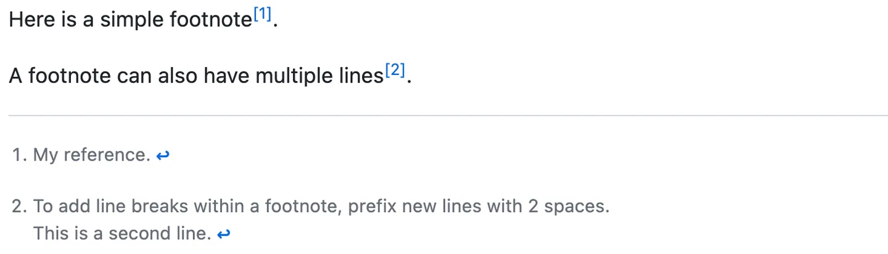
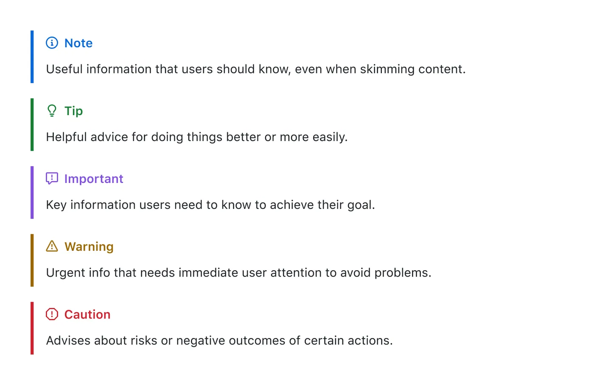

# Learn Markdown fast
## Basic syntax
The easiest way to do this is by opening a Markdown file on your repository.

1. Navigate to a repository you own on [github.com](https://github.com).
2. Make sure you are on the **Code** tab of your repository.
3. Click **Add file** near the top of the window and select **Create new file** from the pull-down menu.
4. In the box at the top of the editor, name your file. Make sure the filename ends in .md (e.g., markdownTestFile.md).
5. Select the **Edit** button.
6. Enter any Markdown syntax into the editor window.

## Headings

```markdown
# A first-level heading
## A second-level heading
### A third-level heading
```

## Styling text

| Style                  | Syntax              | Keyboard shortcut                                                                     | Example                                  | Output                                 |                                                   |
| ---------------------- | ------------------- | ------------------------------------------------------------------------------------- | ---------------------------------------- | -------------------------------------- | ------------------------------------------------- |
| Bold                   | `** **` or `__ __`  | <kbd>Command</kbd>+<kbd>B</kbd> (Mac) or <kbd>Ctrl</kbd>+<kbd>B</kbd> (Windows/Linux) | `**This is bold text**`                  | **This is bold text**                  |                                                   |
| Italic                 | `* *` or `_ _`      | <kbd>Command</kbd>+<kbd>I</kbd> (Mac) or <kbd>Ctrl</kbd>+<kbd>I</kbd> (Windows/Linux) | `_This text is italicized_`              | *This text is italicized*              |                                                   |
| Strikethrough          | `~~ ~~` or `~ ~`    | None                                                                                  | `~~This was mistaken text~~`             | ~~This was mistaken text~~             |                                                   |
| Bold and nested italic | `** **` and `_ _`   | None                                                                                  | `**This text is _extremely_ important**` | **This text is *extremely* important** |                                                   |
| All bold and italic    | `*** ***`           | None                                                                                  | `***All this text is important***`       | ***All this text is important***       | <!-- markdownlint-disable-line emphasis-style --> |
| Subscript              | `<sub> </sub>`      | None                                                                                  | `This is a <sub>subscript</sub> text`    | This is a <sub>subscript</sub> text    |                                                   |
| Superscript            | `<sup> </sup>`      | None                                                                                  | `This is a <sup>superscript</sup> text`  | This is a <sup>superscript</sup> text  |                                                   |
| Underline              | `<ins> </ins>`      | None                                                                                  | `This is an <ins>underlined</ins> text`  | This is an <ins>underlined</ins> text  |                                                   |

## Quoting text
You can quote text with a <kbd>></kbd>.

```markdown
Text that is not a quote

> Text that is a quote
```

##Below demonstrates the basic rules used to generate anchors from headings in rendered content.

```markdown
# Example headings

## Sample Section

## This'll be a _Helpful_ Section About the Greek Letter Θ!
A heading containing characters not allowed in fragments, UTF-8 characters, two consecutive spaces between the first and second words, and formatting.

## This heading is not unique in the file

TEXT 1

## This heading is not unique in the file

TEXT 2

# Links to the example headings above

Link to the sample section: [Link Text](#sample-section).

Link to the helpful section: [Link Text](#thisll-be-a-helpful-section-about-the-greek-letter-Θ).

Link to the first non-unique section: [Link Text](#this-heading-is-not-unique-in-the-file).

Link to the second non-unique section: [Link Text](#this-heading-is-not-unique-in-the-file-1).
```
## Lists

You can make an unordered list by preceding one or more lines of text with <kbd>-</kbd>, <kbd>\*</kbd>, or <kbd>+</kbd>.

```markdown
- George Washington
* John Adams
+ Thomas Jefferson
```


To order your list, precede each line with a number.

```markdown
1. James Madison
2. James Monroe
3. John Quincy Adams
```


## Task lists

To create a task list, preface list items with a hyphen and space followed by `[ ]`. To mark a task as complete, use `[x]`.

```markdown
- [x] #739
- [ ] https://github.com/octo-org/octo-repo/issues/740
- [ ] Add delight to the experience when all tasks are complete :tada:
```

## Footnotes

You can add footnotes to your content by using this bracket syntax:

```text
Here is a simple footnote[^1].

A footnote can also have multiple lines[^2].

[^1]: My reference.
[^2]: To add line breaks within a footnote, add 2 spaces to the end of a line.  
This is a second line.
```

The footnote will render like this:




## Alerts

To add an alert, use a special blockquote line specifying the alert type, followed by the alert information in a standard blockquote. Five types of alerts are available:

```markdown
> [!NOTE]
> Useful information that users should know, even when skimming content.

> [!TIP]
> Helpful advice for doing things better or more easily.

> [!IMPORTANT]
> Key information users need to know to achieve their goal.

> [!WARNING]
> Urgent info that needs immediate user attention to avoid problems.

> [!CAUTION]
> Advises about risks or negative outcomes of certain actions.
```

Here are the rendered alerts:




## Hiding content with comments

You can tell GitHub to hide content from the rendered Markdown by placing the content in an HTML comment.

```text
<!-- This content will not appear in the rendered Markdown -->
```


## Reference
1. https://github.blog/developer-skills/github/github-for-beginners-getting-started-with-markdown/
2. https://docs.github.com/en/get-started/writing-on-github/getting-started-with-writing-and-formatting-on-github/basic-writing-and-formatting-syntax
